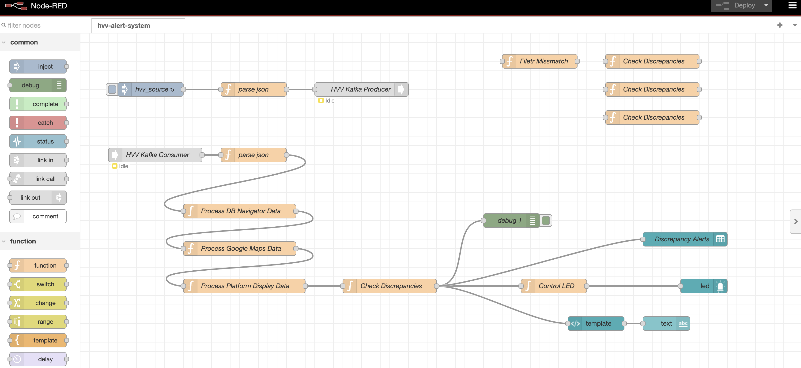

# **Quality Monitoring Dashboard** 


### **[Hamburg Hackathon 2024](https://data.deutschebahn.com/opendata/Veranstaltungen/Hamburg-Hackathon-2024-12737422)**
#hackaroundtheÖPNV #MobilitätFürALLE😀 #jetztseidihramZug 

## **Problem Statement**    

## Reisendeninformation: Qualitätsmonitoring
The reliability of real-time public transportation data across different platforms is crucial for commuters and public transportation management. Currently, there are significant discrepancies between the public transport data presented by the **HVV app** (Geofox API) and the **DB Navigator app** (RIS API), causing confusion for travelers.

### **The Challenge**
- **Inconsistent Data**: Multiple platforms provide real-time travel information, but discrepancies occur between the data shown in the **HVV app** (Geofox API) and the **DB Navigation App** (Hafas API + RIS API).
- **Delay Reporting**: Delays and disruptions are reported differently across platforms, leading to frustration for commuters and poor management decisions.
  
## **Our Solution**

To address these inconsistencies, our solution aims to automate the process of identifying and analyzing delay discrepancies by comparing data from the **Geofox API** (used by HVV app) and the **RIS API** (ground truth system). Here's how we plan to solve this:

### 🛠 **Core Features**
1. **Data Comparison**: Real-time data from the **Geofox API** and **RIS API** is fetched and analyzed to detect discrepancies in reported delays and schedules.
2. **Cross-Platform Consistency Check**: [Future Work...]
3. **Discrepancy Visualization**: Detected discrepancies are presented in an intuitive dashboard to provide insights into the accuracy of each platform (currently for prototype single line is used).
4. **Automated Alerts**: Alerts are triggered when inconsistencies are found, helping operators improve data quality and offer better service to travelers.
5. **Scalable Architecture**: Built using scalable, modern technologies, ensuring future expansion to other transportation networks beyond Hamburg.

### 🚀 **Tech Stack**
- **Backend**: Node.js, Express.js, Node-red
- **Data Sources**: Geofox API (HVV app), RIS API (DB Navigator)
- **Message Broker**: Kafka for handling real-time data processing (Updates, Delays, special events etc)
- **Visualization**: Node-red UI , Express UI for discrepancy reports and analytics
- **Automation & Monitoring**: Node-RED for automated quality control system
- **Deployment**: Docker for containerization

## **How It Works**
1. **Data Collection**: The system retrieves real-time public transport data from the **Geofox API** and **RIS API**.
2. **Data Processing**: The fetched data is processed and cross-compared to identify differences in delay reporting and train schedules.
3. **Discrepancy Detection**: When discrepancies are found, they are logged and analyzed for further insights.
4. **Visualization & Alerts**: The discrepancies are displayed on an interactive dashboard, and alerts are sent to relevant authorities or users.
   
## **Our Vision**
Our goal is to create a uniform and reliable public transport information system for commuters. By eliminating discrepancies, we aim to:
- Enhance **traveler trust** in public transport apps
- Assist **operators** in identifying data issues before they impact passengers
- Lay the groundwork for a future where **all public transport data is fully aligned and accurate** across platforms


## **Final Presentation**
- [Link](final_presentation.pptx)


## **Team DigiLab**
- **Developers**: Hossein, Nizam
- **UI/UX Designer**: Sonia


## **How to Run This Project Locally**

Clone the repository:
   ```bash
   git clone https://github.com/your-repo/hackathon-project.git

```
## Node-red Dashboard setup

1. goto Directory:    
   ```bash
   cd hvv_quality_control_system_nodered

2. build docker container
    ```bash
    docker-compose up -d --build

3. Access the dashboard
   ```
   Backend Flow: http://localhost:1880/
   
   Dashboard UI: http://localhost:1880/ui
   ```
## React Dashboard setup
1. Create React app:  
   ```bash
   npx create-react-app react_dashboard
   cd react_dashboard
   ```
2. build and start the app
    ```bash
   npm run build
   npm start
   ```
3. Access the dashboard
   ```
   Dashboard: http://localhost:3000/
   ```

## Screenshots of Dasboard
#### 1. Nodered Flow (Backend)


#### 2. Nodered UI (Descrepancy Detected)


#### 3. Nodered UI (No Descrepancy)


#### 4. React - Monitoring Dashboard


## Contact Details

For any inquiries or collaboration, please contact us at:

Name : Oblonczek, Sonia (sonia.oblonczek@lsbg.hamburg.de)

Name : Banay, Hossein (hossein.banay@lsbg.hamburg.de)

Name : Syed, Nizam (nizamuddin.syed@lsbg.hamburg.de)

